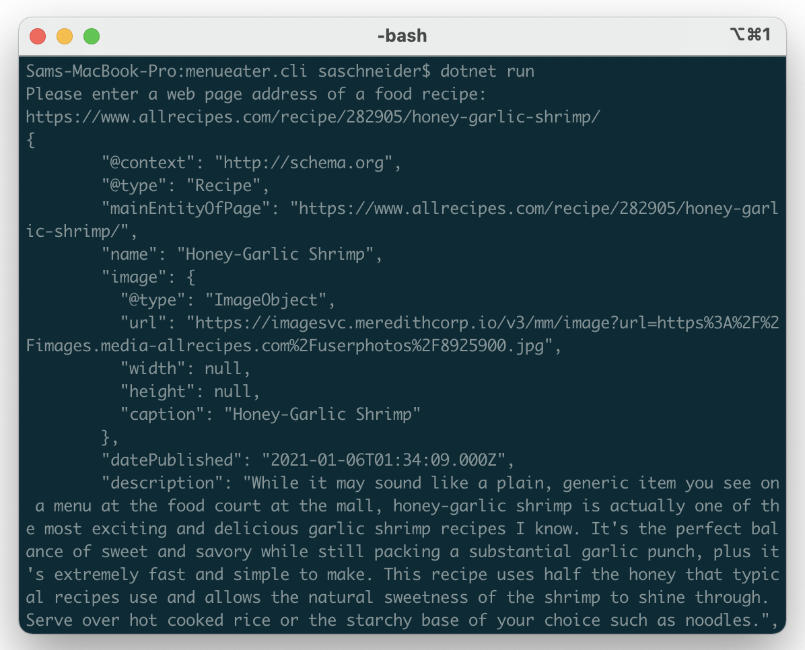

# MenuEater

An app that eats menus on the internet and allows them to be curated by a community.

## MenuEater CLI

The CLI app takes in a simple web address of an online recipe. If the recipe can be parsed, the recipe is outputted to the console.

Ultimately the CLI allows us to develop and debug our menu scraping capabilities separately from the web app.

### Usage

To run the CLI, `cd` into `menueater.cli` folder, then:

    dotnet run

### Examples

